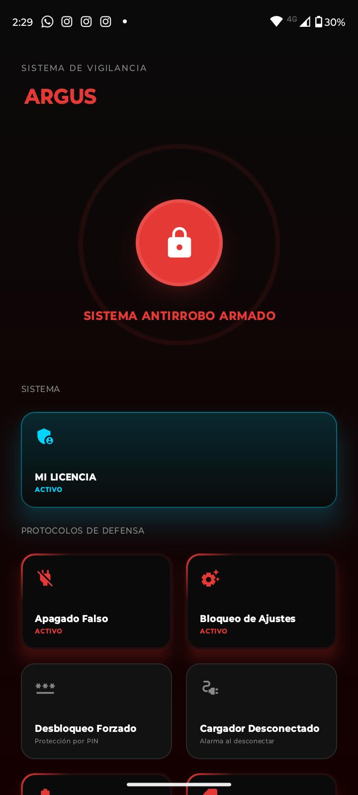
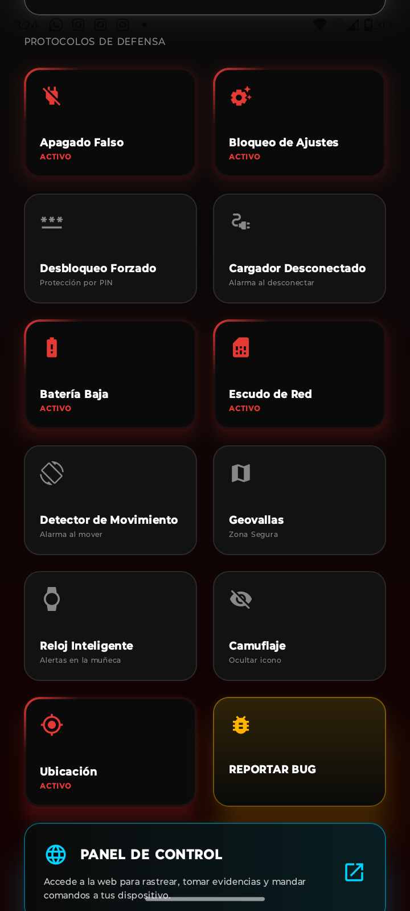
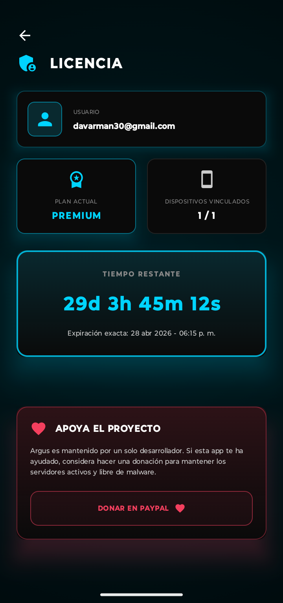
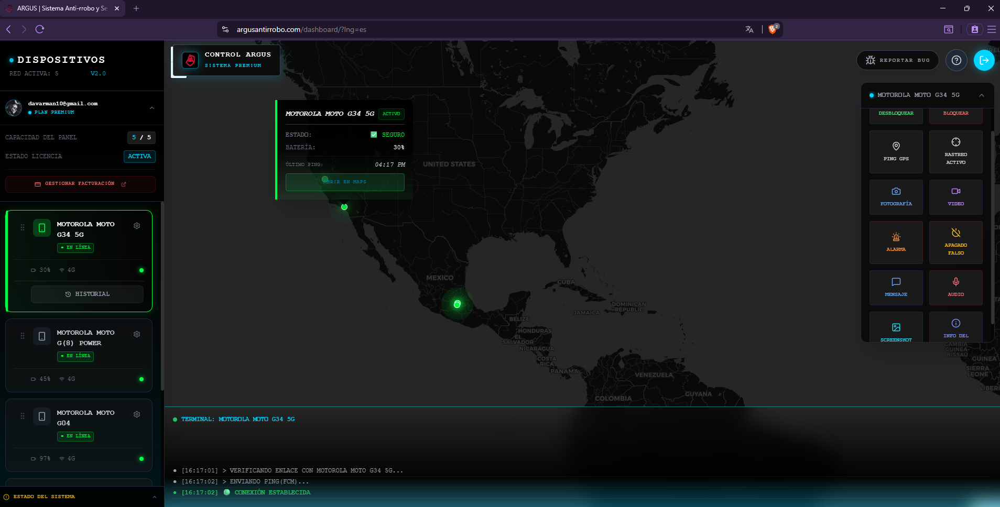

    

# `>_` Argus Anti-rrobo (Security System)

**Plataforma de Seguridad Integral, Defensiva y Táctica para Android. Rastreo, telemetría y contramedidas activas.**

 

| 🛡️ | **Estado** | **Descripción y Novedades** |
| :---: | :--- | :--- |
| **v2.5** | 🚀 **Estable** | *Suite de Seguridad Activa: Cliente Android (El Escudo) + Panel Web (El Arsenal).*   **¡Descarga el APK oficial abajo!**    

<strong>✨ Clic para ver Novedades v2.5</strong>
 Esta actualización introduce contramedidas autónomas y control total remoto:  <b>🛡️ Defensa Activa</b><ul><li><b>Apagado Falso Remoto y Local:</b> Simula que el equipo se apaga, pero mantiene el rastreo y la cámara activos.</li><li><b>Tolerancia a Desconexión (Watchdog):</b> Si envías un comando sin internet, se encola y ejecuta apenas recupere la señal.</li><li> Evidencias multimedia directas a tu correo. El servidor no retiene nada.</li></ul>
 |

 

---

    
Desplegar Tabla de Contenidos

    
 
        
- [`>_` Argus Anti-rrobo (Security System)](#_-argus-anti-rrobo-security-system)
  - [`>_` Propósito](#_-propósito)
  - [`>_` 🎥 Demos en Vivo](#_--demos-en-vivo)
  - [`>_` 📱 Galería de Pantallas](#_--galería-de-pantallas)
  - [`>_` ⬇️ Descarga Oficial](#_-️-descarga-oficial)
  - [`>_` Características](#_-características)
    - [El Arsenal (Comandos Web Remotos)](#el-arsenal-comandos-web-remotos)
    - [Los Centinelas (Seguridad Automática)](#los-centinelas-seguridad-automática)
  - [`>_` Arquitectura y Seguridad](#_-arquitectura-y-seguridad)
  - [`>_` Instalación](#_-instalación)
  - [`>_` ❓ Solución de Problemas (FAQ)](#_--solución-de-problemas-faq)
  - [`>_` Reporte de Vulnerabilidades](#_-reporte-de-vulnerabilidades)
  - [`>_` 🙌 Créditos y Desarrollador](#_--créditos-y-desarrollador)
    - [`>_` ⚖️ Aviso Legal (Disclaimer)](#_-️-aviso-legal-disclaimer)

---

## `>_` Propósito

Argus no es solo un rastreador GPS; es un **Sistema de Defensa Táctica**. Desarrollado con el objetivo de proporcionar recuperación real y protección de datos, la plataforma se divide en un cliente de bajo nivel que blinda el dispositivo (impidiendo accesos no autorizados) y un Panel de Control Web que permite reaccionar ante una emergencia.

**Casos de Uso Principales:**
- **Recuperación de Dispositivos:** Rastreo continuo y toma de evidencia (foto, video, audio) del perpetrador.
- **Protección de Datos:** Bloqueo físico del equipo y prevención de apagado para evitar que desactiven la conexión.
- **Disuasión Inmediata:** Detonación de alarmas a máximo volumen y flashes estroboscópicos ignorando el modo silencio.

> [!Caution]
> **Aviso de Permisos Sensibles:**  
> Para funcionar como un escudo real, Argus requiere privilegios profundos del sistema (Administrador de Dispositivos, Accesibilidad, Superposición). Sistemas como **Google Play Protect** pueden alertar sobre estos permisos. **Esto es normal**. Son las "armas" que Argus necesita para protegerte.

---

## `>_` 📱 Galería de Pantallas

Explora la interfaz móvil y el centro de mando:

     
    <table>
        <tr>
            <td align="center" width="50%">
                <strong>Dashboard Móvil (El Escudo)</strong> 
                
            </td>
            <td align="center" width="50%">
                <strong>Configuración de Centinelas</strong> 
                
            </td>
        </tr>
        <tr>
            <td align="center" width="50%">
                <strong>Licencia en App</strong> 
                
            </td>
            <td align="center" width="50%"> <strong>Arsenal Web (Centro de Mando)</strong> 
                
            </td>
        </tr>
    </table>
     

---

## `>_` ⬇️ Descarga Oficial

Este repositorio es el único canal oficial de distribución. Descarga el archivo `argus_v2.5.apk` directamente desde la sección de **Releases**:

  

---

## `>_` Características

Argus opera en dos frentes simultáneos para garantizar la seguridad:

### El Arsenal (Comandos Web Remotos)
Accede a tu panel desde cualquier PC o celular y ejecuta:
- **📍 Rastreo Activo y Ping:** Coordenadas en tiempo real.
- **📸 Intercepción Multimedia:** Toma fotos, videos (15s) o graba audio ambiental de forma 100% silenciosa.
- **🚨 Modo Pánico:** Alarma y flash a máxima potencia, anulando el modo "No Molestar".
- **💀 Falso Apagado Remoto:** Finge que el dispositivo se apaga para que el ladrón deje de intentar vulnerarlo.
- **💬 Mensaje Persistente:** Proyecta un texto en pantalla que el intruso no puede cerrar.

### Los Centinelas (Seguridad Automática)
Vigilan tu dispositivo 24/7 sin necesitar comandos:
- **Tácticas Anti-Apagado:** Intercepta el botón físico y muestra un menú falso.
- **Desbloqueo Forzado:** Toma una foto automáticamente tras 3 intentos fallidos de PIN.
- **Sensores de Perímetro:** Detonan la alarma si se **desconecta el cargador**, si **extraen la SIM**, o si se detecta **movimiento brusco**.
- **Protocolo Último Aliento (Batería 5%):** Envía ubicación/foto automática y baja el brillo a cero antes de morir.

---

## `>_` Arquitectura y Seguridad

Este ecosistema ha sido diseñado bajo estrictos estándares de la industria:

| Componente | Descripción |
| :--- | :--- |
| **Criptografía** | AES-256 (en reposo) y túneles TLS 1.2/1.3. La evidencia no se guarda en servidores secundarios. |
| **Arquitectura** | Cliente Android nativo de bajo nivel + Panel Web. |
| **Autenticación** | Validada criptográficamente vía Google Auth. Pagos seguros vía Stripe (PCI-DSS Nivel 1). |
| **Detección Root** | Autodestrucción de ejecución si detecta sistema operativo modificado (Root/Jailbreak) para proteger los datos. |

---

## `>_` Instalación

1.  **Ajuste de Play Protect:** En Google Play Store > Perfil > Play Protect > Configuración, desactiva temporalmente el análisis. *(Requerido debido a la integración profunda en el núcleo del sistema).*
2.  **Descarga:** Obtén el archivo `.apk` desde los *Releases* de este repositorio.
3.  **Permisos Críticos:** Al abrir la app, deberás conceder privilegios de *Administrador de Dispositivos* y *Accesibilidad*. Sigue las instrucciones en pantalla para el "Ajuste Restringido" si estás en Android 13+.
4.  **Verificación:** Puedes reactivar Play Protect y realizar un escaneo. Google confirmará que Argus está instalado y seguro.
5.  **Excepción de Batería:** Ve a los ajustes de tu teléfono y asegúrate de quitarle la "Optimización de Batería" a Argus para que el rastreo no se duerma.

---

## `>_` ❓ Solución de Problemas (FAQ)

**P: ¿Por qué Google Play Protect u otros antivirus me lanzan una advertencia?**
> **R:** Argus utiliza permisos para evitar su propia desinstalación y para poder bloquear la pantalla. Los sistemas automatizados detectan esto como un "Falso Positivo" porque es un comportamiento inusual para una app común, pero vital para una app Anti-robo.

**P: El panel web dice "Terminal en Espera" o no actualiza el GPS.**
> **R:** Si el equipo está encendido, es probable que la capa de personalización (Xiaomi, Samsung, Motorola) esté "durmiendo" la app. Debes ir a los ajustes de batería de Argus y ponerla en **"Sin Restricciones"** o **"Permitir siempre"**.

**P: ¿Cómo desinstalo Argus de mi celular?**
> **R:** El botón de desinstalar estará bloqueado (¡esa es la idea!). Para removerla, primero debes ir a `Ajustes > Seguridad > Administradores de Dispositivos`, desmarcar a Argus y luego desinstalarla normalmente.

---

## `>_` Reporte de Vulnerabilidades

Como este repositorio distribuye una aplicación de código cerrado por motivos de seguridad, los Issues están deshabilitados. 
Si encuentras un *bug* o anomalía, por favor utiliza el **Centro de Ayuda / Reportar Bug** dentro de la misma aplicación móvil o en el Panel Web. Cada reporte es analizado personalmente.

---

## `>_` 🙌 Créditos y Desarrollador

- 👨‍💻 Arquitectura, diseño y desarrollo Full-Stack por **David Platas**.
- 🛡️ Operando bajo el principio de "Privacidad por Diseño".

  

 

### `>_` ⚖️ Aviso Legal (Disclaimer)

> [!Warning]
> **Tolerancia Cero al Mal Uso (Stalkerware):**  
> Argus Security System está diseñado **exclusivamente** para proteger dispositivos de tu propiedad legal y absoluta. Queda ESTRICTAMENTE PROHIBIDA la instalación de este software en dispositivos de terceros (parejas, empleados, etc.) sin su consentimiento. Argus LLC colaborará plenamente con las autoridades entregando registros de IP y cuentas si se requiere por orden judicial ante actividades delictivas o de acoso.
